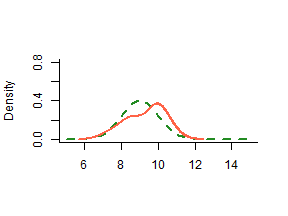

## The idea
The normal distribution is probably the most famous and widely used statistical model, its relevance in all the fields of natural and social sciences can not be denied.   

In my personal experience as Teaching Assistant at the University of Perugia (Italy), I have found particularly important for students who first approach to the study of any statistical distribution (or density function) to master as soon as possible its geometrical interpratation. 

For this reason I have decided to create a simple and easy-to-use shiny app, conceived as a teaching tool, that allows the student to see directly the effects of changes of the parameters on the distribution shape. 

Everybody knows that the shape of the normal distribution resembles that of a bell, so it sometimes is referred to as the "bell curve". The title of my project is **"Ring my Bell... Curve!"** and recalls the famous 70s hit of Anita Ward. ;)

--- 

## Choose the parameters
The probability density function for the normal distribution is: $$P(x)=\frac{1}{\sigma \sqrt{2 \pi}}e^{- \frac{\left( {x - \mu } \right)^2}{2\sigma ^2}}$$ where $\mu$ is the theoretical mean and $\sigma$ the standard deviation. Using the sliders, in the App the user can choose a value for both the parameters and look at how the shape of the distribution changes.

```r
curve(dnorm(x, -5, 1),   col = "forestgreen", lwd=2, xlim=c(-10,20), bty="l", ylab="Density", xlab="Real numbers")
curve(dnorm(x, 10, 2.5), col = "tomato", lwd=2, add=TRUE)
```


--- 

## Choose the sample size
A sample extracted from a normal population results normally distributed itself. The larger the sample, the better is the approximation to the theorethical distribution. The App allows the user to choose the sample size and to look at the differences between empirical and theoretical distribution.


```r
small <- rnorm(10, 9, 1)
curve(dnorm(x, 9, 1), col = "forestgreen", lty = 2, lwd = 2, xlim=c(5,15), ylim=c(0, 0.8), bty="l", ylab="Density", xlab="")
lines(density(small), col = "tomato", lwd = 2)
```



--- 

## Look at the interactive graphs
The App returns an interactive visualization of both the sample and the teoretical distribution.
The visualization is composed by a boxplot, a histogram and a kernel density plot.


